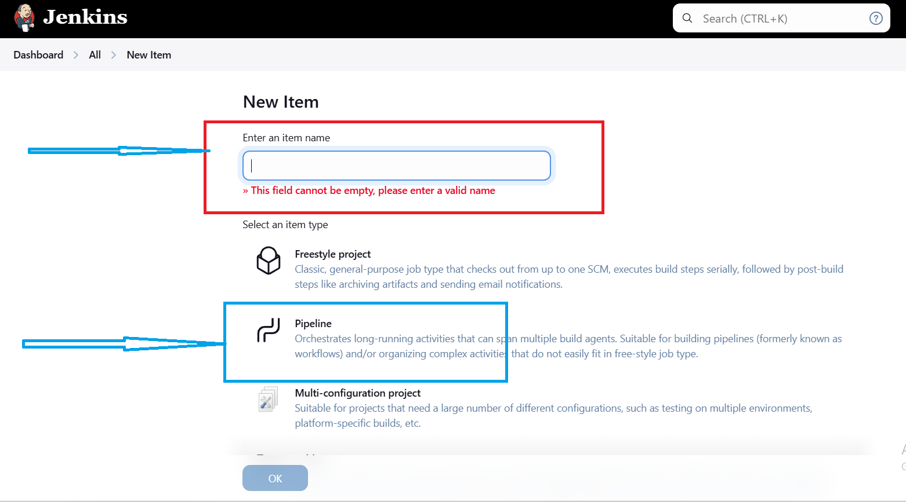
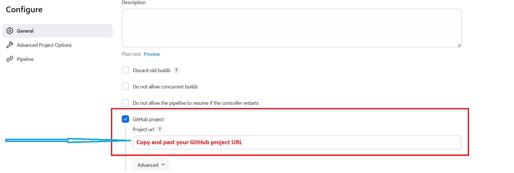
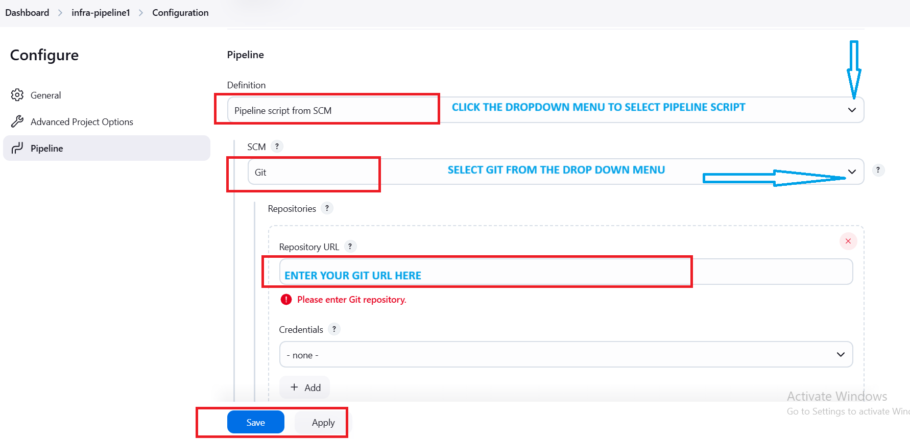
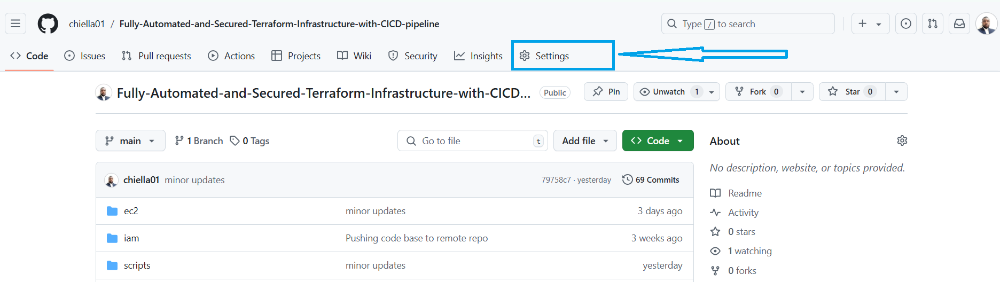
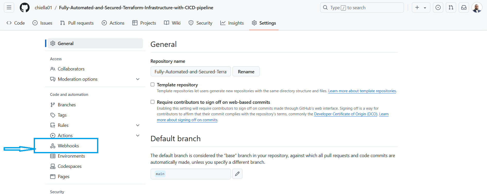
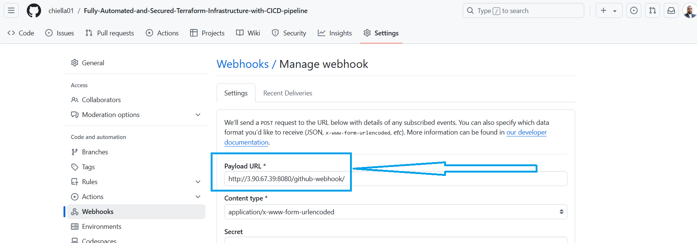
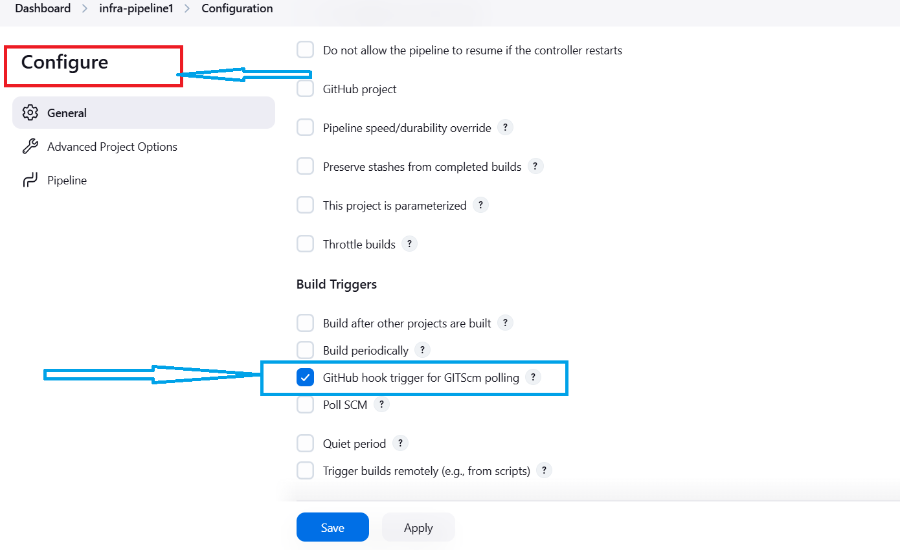
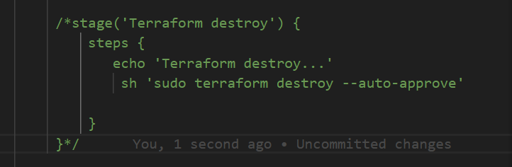
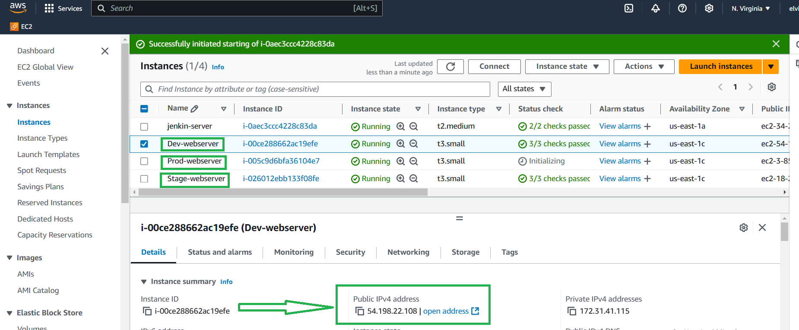
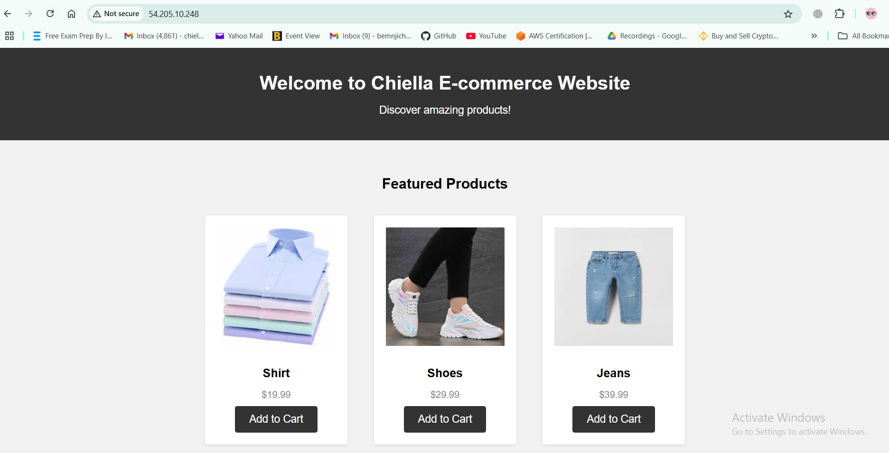

# Fully-Automated-and-Secured-Terraform-Infrastructure-with-CICD-pipeline


## Overview

#### In this project, I build a CICD pipeline to automate the deployment of a simple ecommerce website on AWS. The project will guide you through setting up a jenkins server on EC2 instance. I equally leverage on terraform modules to create an ec2 instance for Dev, Stage, & Prod environments. The Ec2 instances are spurn up with a userdata script that Install Apache HTTP Server, clone the  the repo hosting the  ecommerce web files. These files are copied to the designated directory and websites can be viewd by opening the public ip of any of the instances(dev, stage, prod)  The following devops tools were used
 * Infrastructure as code using terraform 
  * Jenkins to perform the builds
  * checkov for scanning and analyzing terraform files for misconfigurations that may lead to security/compliance issues.
  * configure slack to post alerts on slack channel
## Prerequisites
    - AWS Account:  Admin access to AWS account
    - AWS CLI: installed and configured with the righ credentials
    - Git: This will be installed on your EC2 instance
    - Jenkins: this will be installed on EC2 instance
    - Terraform: install terraform on EC2 instance


1) [Link to  GitHub hosting the project files](https://github.com/chiella01/Fully-Automated-and-Secured-Terraform-Infrastructure-with-CICD-pipeline)     
    
## CICD Infra setup
2) ###### Install Jenkins on EC2
    - Create an **Amazon Linux 2023 AMI VM** instance and call it "Jenkins"
    - Instance type: t2.medium
    - Security Group (Open): 8080 and 22 
    - Key pair: Select or create a new keypair
    - **Attach Jenkins server with IAM role having "AdministratorAccess"**
 ## User data 
 
```bash
  
#!/bin/bash
# Hardware requirements: Amazon Linux 2 with mimum t2.medium type instance & port 8080(jenkins) 
#Note: Use the latest EC2 Linux of 2023 
# Installing Jenkins & Java
sudo dnf update
sudo dnf install java-17-amazon-corretto -y
java -version
ssudo wget -O /etc/yum.repos.d/jenkins.repo     https://pkg.jenkins.io/redhat-stable/jenkins.repo
sudo wget -O /etc/yum.repos.d/jenkins.repo     https://pkg.jenkins.io/redhat-stable/jenkins.repo
sudo rpm --import https://pkg.jenkins.io/redhat-stable/jenkins.io-2023.key
sudo dnf install jenkins -y
sudo systemctl enable jenkins
sudo systemctl start jenkins

# Adding jenkins to the sudoers group
echo 'jenkins  ALL=(ALL)    NOPASSWD: ALL' >> /etc/sudoers

# Installing Git
sudo yum install git -y

# Setup terraform
sudo yum install -y yum-utils
sudo yum-config-manager --add-repo https://rpm.releases.hashicorp.com/AmazonLinux/hashicorp.repo
sudo yum -y install terraform

#installing python3
sudo yum update && sudo yum install python3-pip -y
sudo yum remove python3-requests -y
```
    
- Launch Instance
- After launching this Jenkins server, attach a tag as **Key=Application, value=jenkins**


## Jenkins setup
1) #### Access Jenkins
    Copy your Jenkins Public IP Address and paste on the browser = ExternalIP:8080
    - Login to your Jenkins instance using your Shell (GitBash or your Mac Terminal)
    - Copy the Path from the Jenkins UI to get the Administrator Password
        - Run: `sudo cat /var/lib/jenkins/secrets/initialAdminPassword`
        - Copy the password and login to Jenkins
    - Plugins: Choose Install Suggested Plugings 
    - Provide username and password details of your choice
        - Username: ****
        - Password: ****
    - Continue and Start using Jenkins

2)  #### Plugin installations:
    - Click on "Manage Jenkins"
    - Click on "Plugins"
    - Click "Available Plugins"
    - Search and Install the following Plugings "Install Without Restart"        
        - **Slack Notification*
        - **pipeline stage view*


3)  #### Pipeline creation
- Click on **New Item**
- Enter an item name: **app-infra-pipeline** & select the category as **Pipeline**

  

    Select git and enter your git URL

    
  

    - Now scroll-down and in the Pipeline section --> Definition --> Select Pipeline script from SCM
    - SCM: **Git**

    

    - Repositories
    - Repository URL: FILL YOUR OWN REPO URL (that we created by importing in the first step)
    - Branch Specifier (blank for 'any'): */main
    - Script Path: Jenkinsfile

    - Save

### GitHub webhook

1) #### Add jenkins webhook to github
    - Access your repo **Fully-Automated-and-Secured-Terraform-Infrastructure-with-CICD-pipeline** on github
    - Goto Settings --> Webhooks --> Click on Add webhook 
    
    

    

    - Payload URL: **htpp://REPLACE-JENKINS-SERVER-PUBLIC-IP:8080/github-webhook/**             (Note: The IP should be public as GitHub is outside of the AWS VPC where Jenkins server is hosted)
    - Click on Add webhook
    
    

2) #### Configure on the Jenkins side to pull based on the event
    - Access your jenkins server, pipeline **app-infra-pipeline**
    - Once pipeline is accessed --> Click on Configure --> In the General section --> **Select GitHub project checkbox** and ensure you have correctly filled in your repo URL of the project **Fully-Automated-and-Secured-Terraform-Infrastructure-with-CICD-pipeline**
    - Scroll down --> In the Build Triggers section -->  **Select GitHub hook trigger for GITScm polling checkbox**



Once both steps above are done click on Save.


### Run the pipeline

Go back to your local, open your  project on VSCODE
Open the **Jenkinsfile** and comment the terraform block section of the pipeline script

Save the changes in both files
Finally push changes to repo __git add . git commit -m "relevant commit message" git push__

Now the pipeline will authomatically pick the code from the git repo and built and deploy the ecommerce websites in the servers
refresh the EC2 instance console to see the newly created servers



Now grap the public IP of one of the instances and see the new applicatoin with an eye-catching ecommerce webpage



## Finally observe the whole flow and understand the integrations :) 

### Destroy the infrastructure

1) #### Once the flow is observed, lets destroy the infra with same code
    - Go back to your local, open your "devops-fully-automated" project on VSCODE
    - Open "Jenkinsfile" comment lines 59, 76-82 & uncomment lines 61, 84-90
    - Save the changes in both files
    - Finally push changes to repo
        `git add .`
        `git commit -m "relevant commit message"`
        `git push`

2) #### Terminate Jenkins EC2 instance

# Happy learning, everyone 😊 😊
